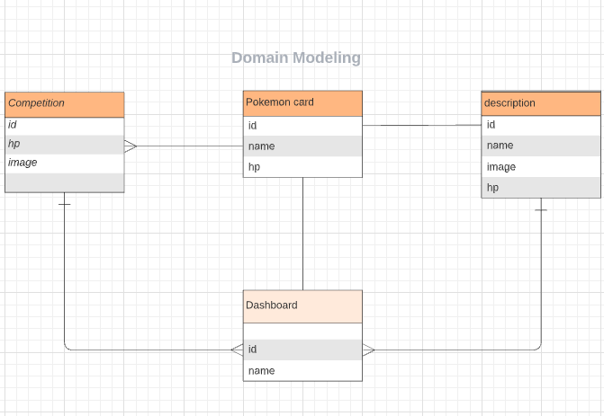

# Pokémon   |   Gotta Catch 'Em All 

# Website name :  Pikaa-Pikaa

# Team members :
 1- Lina Al-mashaikh (team leader)
 
 2- Mohammad Khamees 
 
 3- Malik Essmaeel
 
 4- Aya Berjawi 

## Conflict Plan

The group process to resolve conflict:
- We can discus the problem and try to clearify the points.
- There will be tasks for each team member debend on specific time , also all the group must be collaborate.
- To escalate the conflict ifresolution attempts are unsuccessful: We can get back to our leader instructor.

## Communication Plan

Communication plan and strategy :
- Communication on Zoom , Slack and Whatsapp.
- Strategy for ensuring everyone’s voice is heard: By hearing all the ideas and then make voting.  
- Creating a safe environment : by Respect and support each other.

## Work Plan

- Identify and assign tasks: Using to do list on Trello .
- project management tools : Slack , GitHub , Trello and git .

## Git Process

- Sharing the repository with teammates : Using Organization on GitHub.
- We will ACP depending on the tasks that finished and PR for each member's pages.
- All group members must review a PR.
- Mohammed Khamees will merges PRs after the end of each task.
- To Communicate when it’s time to merge : on Slack / Zoom .

********************************

# Wireframes 

- Signup page

- Login page

- Homepage

- Dashboard page

- Descreiption page

- AboutUs

- Characters

- Start game

- Competition page

- Win or Lose page

********************************

- Domain Modeling

